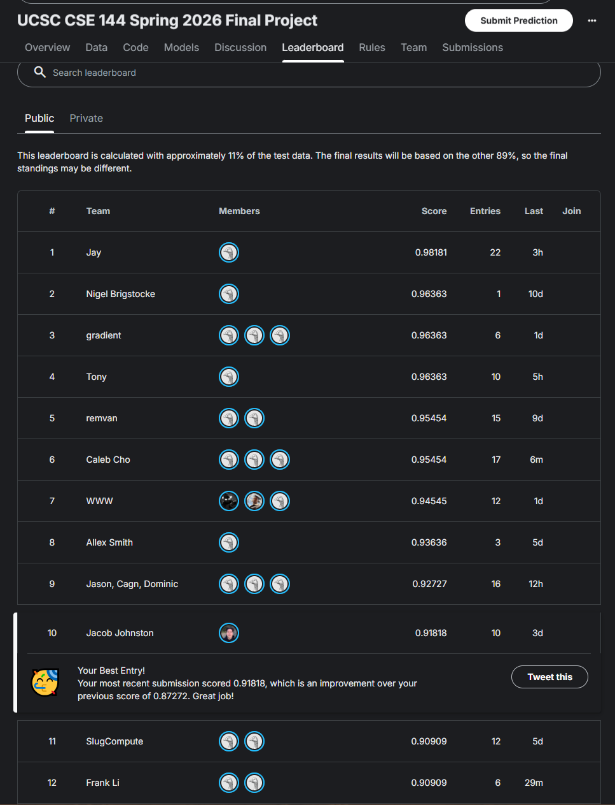
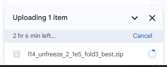

# CSE 144 Final Project — Transfer Learning Challenge (Spring 2026)
UC Santa Cruz

## Overview
100-class image classification with ~10 training images per class (1,079 train / 1,036 test images), solved by linear-probe-then-fine-tune (LP-FT) on `open_clip` ViT backbones with all decisions made by stratified 4-fold cross-validation. Final model: **4-fold checkpoint ensemble of ViT-L/14 (LAION-2B), public leaderboard 0.91818**.

## Kaggle Leaderboard


Screenshot taken 6/10/2026 @ 11:09PM PST. Public leaderboard is computed on ~11% of the test set.

## Results summary
 
| Stage | Public score | 4-fold CV (mean ± std) |
|---|---|---|
| ViT-B/16 LAION-2B, head only | — | 0.8499 ± 0.0085 |
| ViT-B/16 LAION-2B, unfreeze last 2 @ 1e-5 | 0.864 (single) / 0.873 (ensemble) | 0.8619 ± 0.0145 |
| **ViT-L/14 LAION-2B, unfreeze last 2 @ 1e-5, 4-fold ensemble** | **0.918** | **0.8925 ± 0.0069** |
 
Full experimental history (including the failed ImageNet baseline, augmentation, and TTA ablations) is in the [report](report/CSE144_Final_Report.pdf).
## Repository structure
 
```
.
├── README.md
├── requirements.txt
├── final_clip_kfold.ipynb        # main pipeline: CV, model selection, training, ensembling
├── oof_blend_check.py            # out-of-fold validation of ensemble variants (optional)
├── report/
│   └── CSE144_Final_Report.pdf
├── assets/
│   └── leaderboard.png
└── checkpoints_kfold/            # model weights go here (see download link below)
```

## Model Weights
Download the four ViT-L/14 fold checkpoints (these produce the final submission) from Google Drive:

Right now, the weights are pending upload. 



Files (place all in `checkpoints_kfold/`):
 
```
l14_unfreeze_2_1e5_fold0_best.pt
l14_unfreeze_2_1e5_fold1_best.pt
l14_unfreeze_2_1e5_fold2_best.pt
l14_unfreeze_2_1e5_fold3_best.pt
```

Each checkpoint is a dict `{model_state_dict, val_acc}` containing the full fine-tuned CLIP model (vision + text tower) plus the classification head.

## Setup
```bash
pip install torch torchvision matplotlib tqdm scikit-learn pillow pandas
```

```bash
pip install -r requirements.txt
```
 
Place the competition data so the layout is:
 
```
data/
├── train/0/ ... train/99/    # 1,079 images
└── test/                     # 1,036 images (0.jpg ... )
```

## Inference (reproduce the submission from provided weights)
 
1. Download the four checkpoints into `checkpoints_kfold/` (link above).
2. Open `final_clip_kfold.ipynb` and run, in order: the **Config**, **Load CLIP**, **Dataset classes**, **Build full sample list**, and **Loss/head/helpers** cells, then the **Stage 1: ViT-L/14** cell header portion that loads the L/14 model, then the **Stage 3** cell with `RUN_L14_SUBMISSION = True`.
3. Output: `submission_l14_ensemble.csv` (1,036 rows, columns `ID,Label`). Inference takes ~[FILL] minutes on an RTX 3060.
The ensemble sums logits from the four fold models and takes the argmax per image.
 
## Training (reproduce the checkpoints)
 
Run `final_clip_kfold.ipynb` top to bottom:
 
1. **B/16 phase** — extracts cached embeddings, runs 4-fold CV over four unfreezing configs (`head_only`, `unfreeze_2_1e6`, `unfreeze_2_1e5`, `unfreeze_4_1e5`), selects by the one-standard-error rule, retrains on all data with the CV-median epoch budget.
2. **Stage 1 (L/14 gate)** — head-only CV on ViT-L/14; proceed only if it beats B/16 head-only by > 2×SE (it does: 0.8823 > 0.8583).
3. **Stage 2** (`RUN_L14_UNFREEZE = True`) — 4-fold LP-FT CV on L/14, saving one checkpoint per fold.
4. **Stage 3** (`RUN_L14_SUBMISSION = True`) — fold-ensemble inference → `submission_l14_ensemble.csv`.
## Reproducibility
 
- Global seed 42; fold *i* reseeds with 42 + *i*. `StratifiedKFold(n_splits=4, shuffle=True, random_state=42)` over a sorted directory traversal makes fold membership deterministic.
- cuDNN determinism flags are not forced, so GPU runs may vary by a fraction of a point; CV numbers are means over 4 folds.
- Hardware used: NVIDIA GeForce RTX 3060 (CUDA), Windows. Exact package versions in `requirements.txt`.
## Method notes
 
- **Why LP-FT:** training the head first on frozen cached embeddings is nearly free (milliseconds per epoch) and avoids the feature distortion a randomly initialized head causes during fine-tuning (Kumar et al., ICLR 2022).
- **Why unfreeze only 2 blocks:** chosen by the one-SE rule — `unfreeze_4` scored higher on mean but within noise of `unfreeze_2`, so the simpler config wins.
- **Why no augmentation:** horizontal flip cost 6.4 public points in ablation; with ~8 images/class/fold and a test set from the same distribution, regularization wasn't worth the input shift.